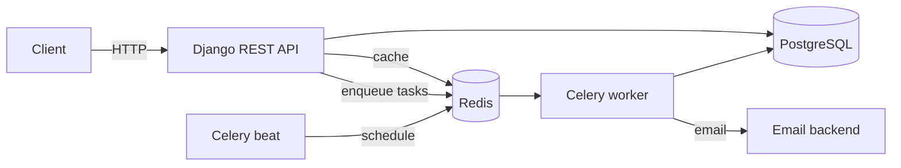

# Todo App API


A role-based task management REST API built with Django and Django REST Framework.
It covers JWT authentication, email verification, background jobs with Celery,
Redis caching and a fully containerized setup.

## Features

- **Authentication**: registration, JWT login/refresh, logout with refresh token blacklisting, change password
- **Email verification**: accounts start inactive and are activated through a time-limited link (15 minutes)
- **Roles**: `student`, `teacher` and `admin`, each with different permissions on tasks
- **Tasks**: CRUD with automatic `finished_date` handling and an optional image
- **Caching**: task lists are cached in Redis and invalidated automatically through Django signals
- **Background jobs** (Celery + Celery Beat):
  - sends verification emails asynchronously
  - every 10 minutes removes expired JWT tokens and unverified accounts older than 3 days
- **Rate limiting**: the resend-verification endpoint is limited to 3 requests per hour
- **API docs**: Swagger UI and ReDoc
- **Tests and CI**: pytest, factory_boy, flake8, GitHub Actions

## Tech stack

Python 3.12, Django 6, Django REST Framework, SimpleJWT, PostgreSQL 16, Redis 7,
Celery, Flower, drf-yasg, Docker Compose, pytest, GitHub Actions.

## Architecture



## Roles and permissions

| Action | Student | Teacher | Admin |
| --- | --- | --- | --- |
| List / view tasks | own tasks only | all tasks | all tasks |
| Create task | no | yes | yes |
| Delete task | no | yes | yes |
| Update task | only `is_done` of own tasks | `title` and `content` (not `is_done`) | all fields |
| List all users | no | no | staff only |

User roles are not editable through the API. Set them from the Django admin or the shell.

## API overview

Interactive docs are available at `/swagger/` and `/redoc/`.

**Users** (`/users/api/v1/`)

| Method | Endpoint | Description |
| --- | --- | --- |
| POST | `registration/` | Create an inactive account and send a verification email |
| GET | `verify-email/?token=...` | Activate the account |
| POST | `resend-verification-email/` | Send a new link (3 per hour) |
| POST | `token/` | Log in and get access and refresh tokens |
| POST | `token/refresh/` | Get a new access token |
| POST | `logout/` | Blacklist a refresh token |
| GET, PUT, PATCH, DELETE | `profile/` | Current user profile |
| POST | `change-password/` | Change password |
| GET | `users/` | List users (staff only) |

**Tasks** (`/website/api/v1/`)

| Method | Endpoint | Description |
| --- | --- | --- |
| GET, POST | `tasks/` | List or create tasks |
| GET, PUT, PATCH, DELETE | `tasks/<id>/` | Retrieve, update or delete a task |

## Getting started

Requirements: Docker and Docker Compose.

```bash
git clone https://github.com/<username>/<repo>.git
cd <repo>

cp .env.example .env      # then edit the values
docker compose up -d --build
```

Migrations run automatically when the backend starts.

| Service | URL |
| --- | --- |
| API | http://localhost:8001 |
| Swagger UI | http://localhost:8001/swagger/ |
| Flower (Celery monitor) | http://localhost:5555 |
| RedisInsight | http://localhost:5540 |

Create an admin user:

```bash
docker compose exec backend python manage.py createsuperuser
```

> **Note:** this Compose file is meant for development (`runserver`, source mounted as a volume).
> Redis and Flower run without a password and are only exposed on `localhost`, so do not
> use this setup as-is on a public server. Emails are printed to the console. To see the verification link after registering, run
> `docker compose logs -f celery_worker`.

### Environment variables

Copy `.env.example` to `.env`. The main variables are:

| Variable | Description |
| --- | --- |
| `SECRET_KEY` | Django secret key |
| `DEBUG` | `True` or `False` (the debug toolbar is only enabled when `True`) |
| `ALLOWED_HOSTS` | Comma-separated list of hosts |
| `POSTGRES_DB`, `POSTGRES_USER`, `POSTGRES_PASSWORD` | Database credentials |
| `POSTGRES_HOST`, `POSTGRES_PORT` | Database location (`db` and `5432` in Docker) |
| `REDIS_HOST`, `REDIS_PORT` | Redis location (`redis` and `6379` in Docker) |
| `BACKEND_URL` | Base URL used to build the links in emails |

## Running tests

```bash
docker compose exec backend pytest --cov=users --cov=website
docker compose exec backend flake8 .
```

Tests use an in-memory cache, so they do not need Redis. The same checks run on every
push and pull request through GitHub Actions.

## Project structure

```
core/       project settings, root URLs, Celery app
users/      custom user model, JWT auth, email verification, Celery tasks
website/    tasks API, role-based permissions, cache helpers and signals
```

Each app keeps its tests in a `tests/` folder.

## Design notes

- The user model uses email as the login field, and new accounts are inactive until verified.
- The resend-verification endpoint returns the same response whether or not the email exists,
  so it cannot be used to find registered addresses.
- Cache keys are shared per role for teachers and admins (they see all tasks) and per user for
  students. Saving or deleting a task clears the affected keys.
- Verification tokens live in the Redis cache and expire on their own, so no extra table is needed.
